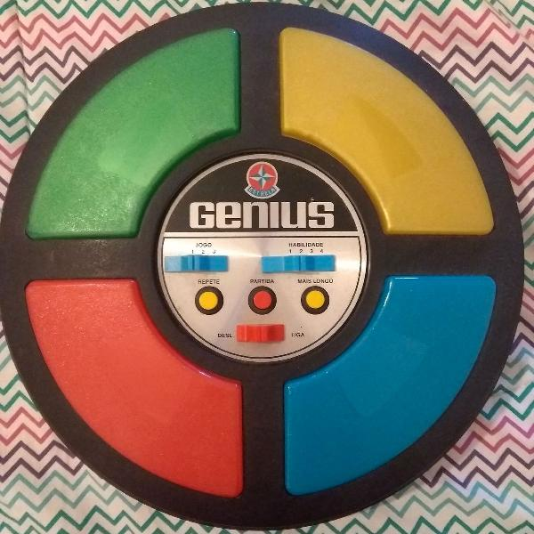

  <H1><b> Jogo Genius </b> </H1>

 

  
  <H2>Jogo Genius criado com javascript, html e css.</H2>

  💻 Programação Orientada a Objetos 
  Linguagens: <strong>JavaScript, HTML e CSS.</strong>

  🛠️ Ferramentas: <strong>Visual Studio Code com NodeJS.</strong>

  💌 Para maiores informações entre em contato: ⤵️

  

  

  

  
  
